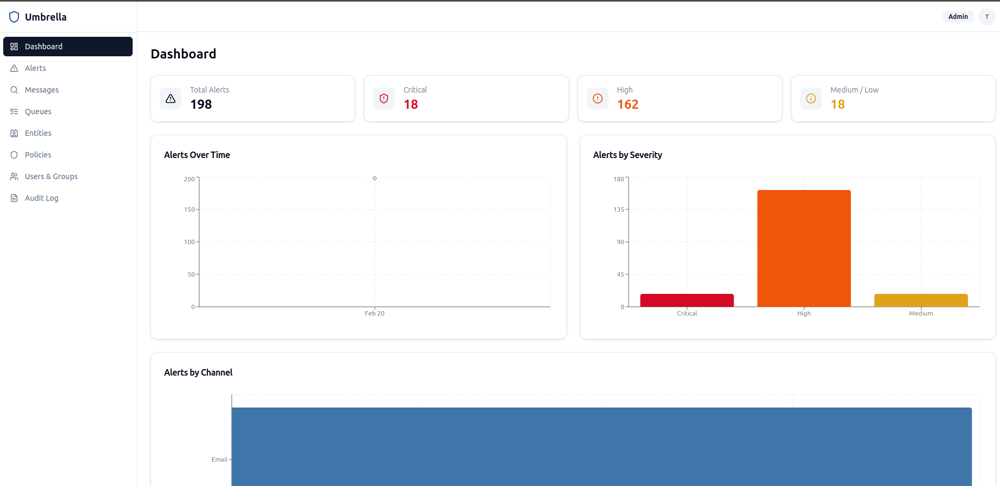
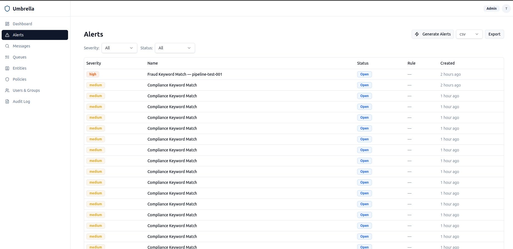
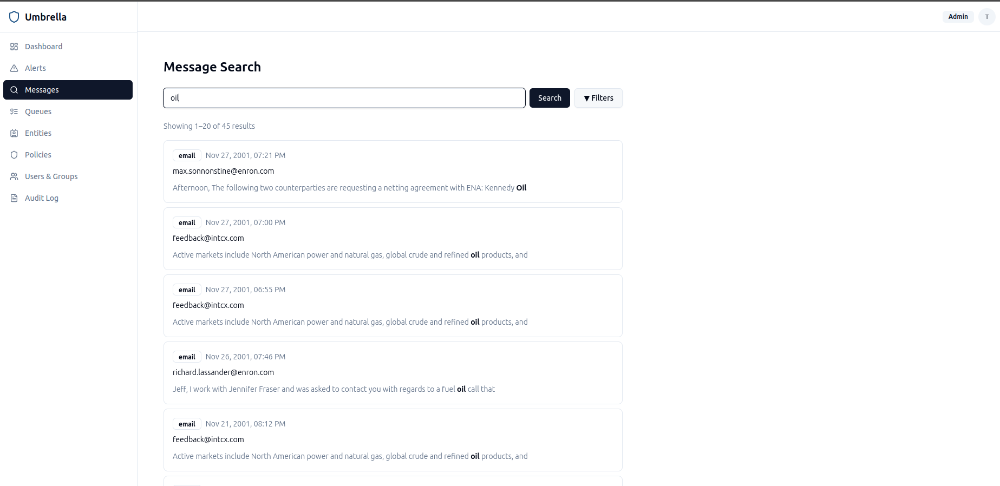
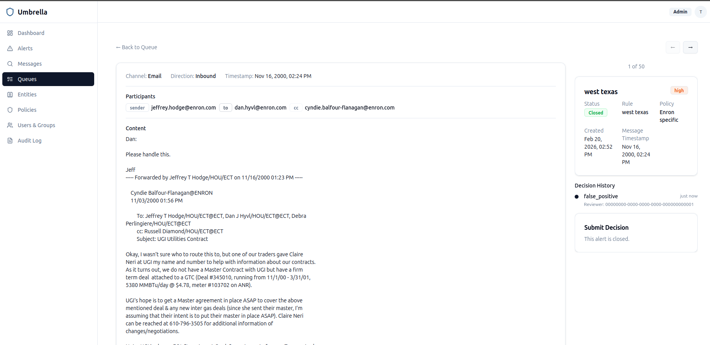
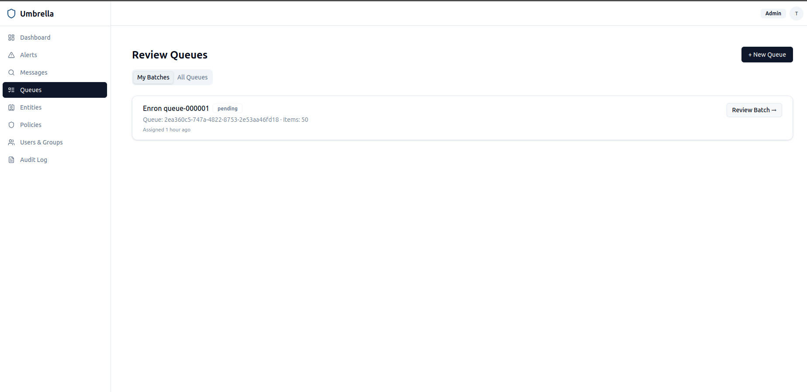
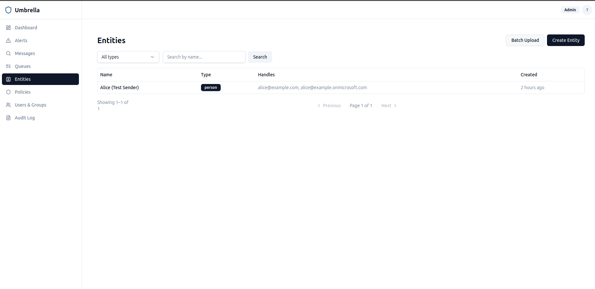
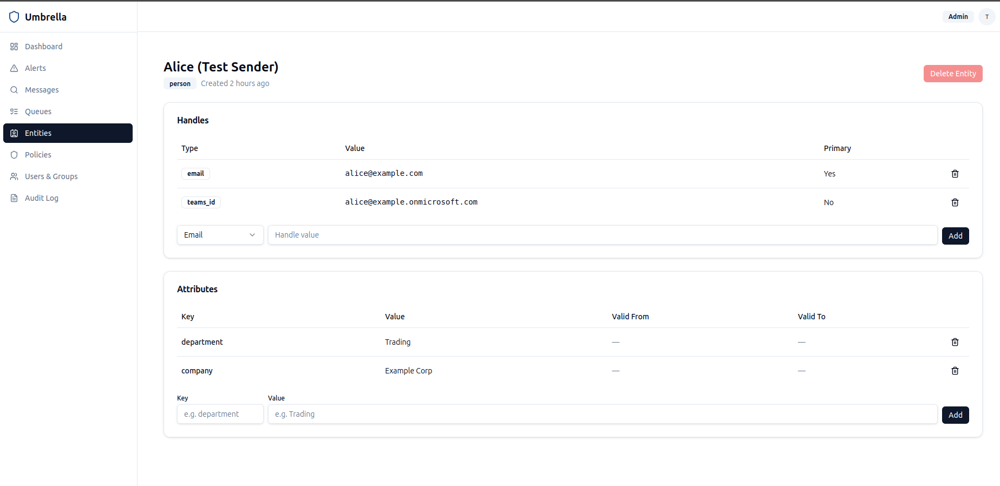
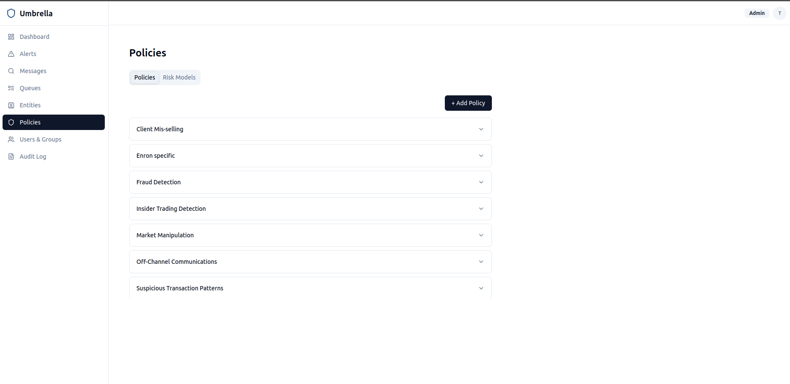
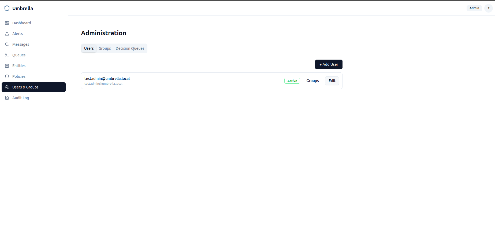
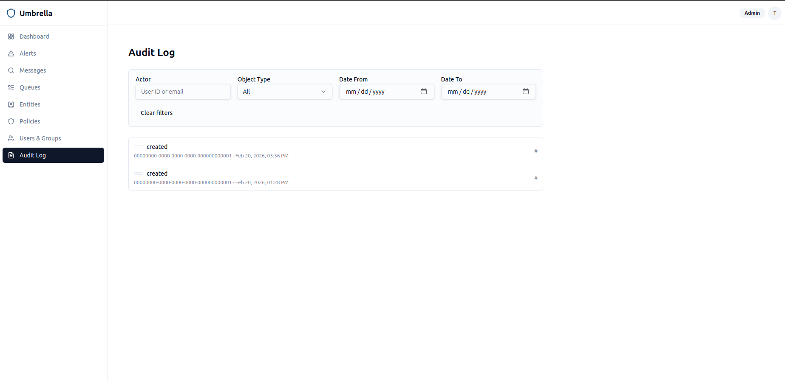

# Umbrella — Regulatory Communications Monitoring Platform

```
                                  .
                             .    |    .
                          .       |       .
                       .          |          .
                    .─────────────┼─────────────.
                 ──'              |              '──
              ──'    ░░░░░░░░░░░░░░░░░░░░░░░░░    '──
           ──'                   |                   '──
        ──'                      |                      '──
      ─'─────────────────────────┼─────────────────────────'─
                                 │
                                 │
                   ╱  ╱  ╱  ╱   │   ╲  ╲  ╲  ╲
                 ╱  ╱  ╱  ╱     │     ╲  ╲  ╲  ╲
               ╱  ╱  ╱  ╱       │       ╲  ╲  ╲  ╲
             ╱  ╱  ╱  ╱         │         ╲  ╲  ╲  ╲
           ╱  ╱  ╱  ╱    ┌─────┴─────┐     ╲  ╲  ╲  ╲
         ╱  ╱  ╱  ╱      │ PROTECTED │       ╲  ╲  ╲  ╲
       ╱  ╱  ╱  ╱        │  comms    │         ╲  ╲  ╲  ╲
     ╱  ╱  ╱  ╱          └───────────┘           ╲  ╲  ╲  ╲
```

## Overview

Umbrella is a regulatory communications monitoring platform designed to capture, normalize, process, and surface electronic communications (eComm) and audio communications (aComm) for compliance review. The platform ingests data from multiple communication channels, applies NLP and transcription pipelines, and presents flagged alerts to compliance reviewers through a custom UI.

The system follows a **microservices architecture** deployed on **Kubernetes**, ensuring each component can be developed, scaled, and deployed independently.

## Regulatory Context & Compliance

Umbrella is built to help financial institutions meet stringent recordkeeping and supervision requirements mandated by global regulators. For banks, broker-dealers, and investment advisers, maintaining a comprehensive and searchable archive of all business communications is not optional—it is a legal necessity.

### Key Regulations
*   **SEC Rule 17a-4**: Requires broker-dealers to preserve "all business-related communications" in a non-rewriteable, non-erasable (WORM) format for a minimum of 3 to 6 years.
*   **CFTC Regulation 1.31**: Mandates that swap dealers, futures commission merchants, and other registrants keep full records of all oral and written communications that lead to a trade.
*   **Federal Reserve (FED)**: Expects robust internal controls and monitoring systems to detect market abuse, insider trading, and misconduct as part of safe and sound banking practices (e.g., SR 13-19).
*   **FINRA Rule 3110**: Specifically requires firms to have a system to supervise the activities of each associated person, including the review of electronic communications.
*   **MiFID II (EU)**: Article 16(7) requires investment firms to record all telephone conversations and electronic communications relating to transactions concluded when dealing on own account and the provision of client order services.
*   **Market Abuse Regulation (MAR)**: Mandates that firms have effective arrangements, systems, and procedures to detect and report suspicious orders and transactions to prevent market manipulation.
*   **FCA (UK)**: The Financial Conduct Authority requires comprehensive recording and monitoring of relevant conversations (COBS 11.8) to protect consumers and maintain market integrity.

### The "Off-Channel" Challenge
Recent enforcement actions by the SEC and CFTC have resulted in billions of dollars in fines for firms failing to capture "off-channel" communications (such as WhatsApp, Signal, or personal SMS). Umbrella addresses this by providing a unified connector framework that can ingest data from any source, ensuring that all business conduct—regardless of the platform—is captured, indexed, and supervised.

## Pipeline Architecture

All communication channels follow the same **three-stage pipeline**. This pattern has been fully implemented for Email and will be replicated for every additional channel.

```
Channel (IMAP, Graph API, SAPI, ...)
    │
    ▼
┌──────────────────────────────────────────────────────────────────────────────┐
│  STAGE 1 — CONNECTOR                                                        │
│  Poll/stream the external system. Store large payloads in S3 using the      │
│  claim-check pattern. Publish RawMessage to Kafka `raw-messages`.           │
└──────────┬───────────────────────────────────────────────────────────────────┘
           │  RawMessage → S3 (payload) + Kafka `raw-messages` (pointer)
           ▼
┌──────────────────────────────────────────────────────────────────────────────┐
│  STAGE 2 — PROCESSOR                                                        │
│  Consume from `raw-messages`. Download payload from S3. Parse the           │
│  channel-specific format into structured data. Publish to Kafka             │
│  `parsed-messages`.                                                          │
└──────────┬───────────────────────────────────────────────────────────────────┘
           │  Structured/parsed data → Kafka `parsed-messages`
           ▼
┌──────────────────────────────────────────────────────────────────────────────┐
│  STAGE 3 — INGESTION / NORMALIZATION                                        │
│  Consume from `parsed-messages`. Run the appropriate channel normalizer     │
│  (via NormalizerRegistry) to produce a NormalizedMessage. Dual-write:       │
│    • NormalizedMessage → Kafka `normalized-messages`                        │
│    • NormalizedMessage → S3 archive                                         │
└──────────┬───────────────────────────────────────────────────────────────────┘
           │  NormalizedMessage → Kafka `normalized-messages` + S3
           ▼
┌──────────────────────────────────────────────────────────────────────────────┐
│  LOGSTASH → ELASTICSEARCH                                                    │
│  Logstash consumes `normalized-messages`, transforms, and indexes into ES.  │
└──────────────────────────────────────────────────────────────────────────────┘
```

### System Architecture

```
┌─────────────────────────────────────────────────────────────────────────────────────┐
│                         STAGE 1 — CONNECTORS                                        │
│                                                                                     │
│  ┌──────────┐ ┌──────────┐ ┌──────────┐ ┌──────────┐ ┌──────────┐ ┌──────────┐    │
│  │  Teams    │ │  Teams   │ │  Unigy   │ │Bloomberg │ │Bloomberg │ │  Email   │    │
│  │  Chat     │ │  Calls   │ │  Turret  │ │  Chat    │ │  Email   │ │  (IMAP)  │    │
│  │ Connector │ │ Connector│ │ Connector│ │ Connector│ │ Connector│ │ Connector │    │
│  └────┬─────┘ └────┬─────┘ └────┬─────┘ └────┬─────┘ └────┬─────┘ └────┬─────┘    │
│       └─────────────┴────────────┴──────┬──────┴─────────────┴────────────┘          │
│                              ┌──────────┴──────────┐                                 │
│                              │   BaseConnector      │   Shared framework:             │
│                              │   Framework          │   Kafka, S3, health,            │
│                              │                      │   DLQ, retry, TaskGroup         │
│                              └──────────┬───────────┘                                │
└─────────────────────────────────────────┼────────────────────────────────────────────┘
                                          │ → S3 (payload) + Kafka `raw-messages`
                                          ▼
┌─────────────────────────────────────────────────────────────────────────────────────┐
│                         STAGE 2 — PROCESSORS                                        │
│  ┌──────────────┐ ┌──────────────┐ ┌──────────────┐ ┌──────────────┐               │
│  │  Email        │ │  Teams Chat  │ │  Teams Call   │ │  Bloomberg   │               │
│  │  Processor    │ │  Processor   │ │  Processor    │ │  Processor   │               │
│  └──────┬───────┘ └──────┬───────┘ └──────┬───────┘ └──────┬───────┘               │
│         └────────────────┴────────────────┴────────────────┘                         │
└────────────────────────────────────┼─────────────────────────────────────────────────┘
                                     │ → Kafka `parsed-messages`
                                     ▼
┌─────────────────────────────────────────────────────────────────────────────────────┐
│                         STAGE 3 — INGESTION / NORMALIZATION                         │
│  ┌─────────────────────┐    ┌──────────────────────┐                                │
│  │  IngestionService    │───▶│  NormalizerRegistry   │                                │
│  │  (Kafka consumer)    │    │  EmailNormalizer      │                                │
│  │                      │    │  TeamsNormalizer      │                                │
│  │                      │    │  BloombergNormalizer  │                                │
│  │                      │    │  TurretNormalizer     │                                │
│  └──────────┬───────────┘    └────────────────────────┘                                │
└─────────────┼────────────────────────────────────────────────────────────────────────┘
              │ → Kafka `normalized-messages` + S3
              ▼
┌─────────────────────────────────────────────────────────────────────────────────────┐
│                         LOGSTASH + ELASTICSEARCH                                    │
│  ┌──────────────────┐        ┌──────────────────────────────────────────────────┐   │
│  │  Logstash         │──────▶│  Elasticsearch Cluster                           │   │
│  │  (Kafka consumer, │       │  indices: messages-*, alerts-*, audit-*          │   │
│  │   transforms,     │       └──────────────────────────────────────────────────┘   │
│  │   index to ES)    │                                                              │
│  └──────────────────┘                                                               │
└──────────────────────────────────┬──────────────────────────────────────────────────┘
                                   │
                   ┌───────────────┼───────────────┐
                   ▼               │               ▼
┌──────────────────────────────┐   │  ┌───────────────────────────────────────────────┐
│         PostgreSQL            │   │  │                 UI LAYER                      │
│  users, policies, alerts,     │   │  │  UI Backend (FastAPI) + Frontend (React)     │
│  entities, review queues,     │   │  └───────────┬───────────────────────────────────┘
│  audit log                    │   │              │
└──────────────────────────────┘   │              ▼
                                   ▼
                   ┌──────────────────────────────────────────────────────────────────┐
                   │         ANALYTICS & AI LAYER  (planned)                          │
                   │                                                                  │
                   │  • RAG Search — semantic search over all comms via vector        │
                   │    embeddings, natural-language queries, cross-channel retrieval  │
                   │  • Agentic Review — AI agents auto-review flagged alerts, draft  │
                   │    dispositions with cited evidence, configurable autonomy       │
                   │  • Agent Context Enrichment — pre-build rich context packages    │
                   │    for reviewers (related comms, entity history, prior decisions)│
                   │  • Workflow Orchestrator — multi-step review workflows with      │
                   │    tool-calling LLM agents and full audit trail                  │
                   └──────────────────────────────────────────────────────────────────┘
```

## Project Structure

- `connectors/`: Channel-specific connectors and the shared framework.
  - `connector-framework/`: Base classes and shared schema (`umbrella-connector-framework`).
  - `email/`: IMAP/SMTP connector implementation.
  - `teams-chat/`, `teams-calls/`, `bloomberg-chat/`, etc.: Future connector implementations.
- `ingestion-api/`: Centralized service for normalization and dual-writing.
- `processing/`: Services for enrichment (Transcription, Translation, NLP).
- `ui/`: Compliance review dashboard (Frontend & Backend).
- `infrastructure/`: Deployment configurations for Kafka, Elasticsearch, PostgreSQL, etc.
- `deploy/`: Kubernetes manifests and Helm charts.
- `scripts/`: Utility scripts for development and testing.

## Key Components

### Connector Layer
Standalone microservices responsible for interfacing with communication channels. They use a common framework for health checks, retries, and dead-letter routing.

### Ingestion API
A centralized gateway that normalizes incoming parsed messages into a unified schema and persists them to both Kafka and S3.

### Processing Layer
- **Transcription Service**: Converts audio (calls) to text with speaker diarization.
- **Translation Service**: Detects languages and translates content to English.
- **NLP Service**: Performs lexicon matching, entity recognition, sentiment analysis, and alert generation.

### Search & Storage
- **Elasticsearch**: Full-text search and indexing of enriched messages and alerts.
- **PostgreSQL**: Stores application state, users, cases, and policy configurations.
- **S3**: Long-term retention of raw, normalized, and processed data.

## Development Setup

The project uses `uv` for python environment management.

```bash
# Install all packages in editable mode
pip install -e connectors/connector-framework/ -e connectors/email/ -e ingestion-api/
```

### Local Infrastructure
Start required services using Docker Compose:

```bash
# Kafka (KRaft single-node)
cd infrastructure/kafka && docker compose up -d

# Elasticsearch + Logstash
cd infrastructure/elasticsearch && docker compose up -d
```

## Running Services

```bash
# Email connector (Stage 1: IMAP → S3 + Kafka)
python -m umbrella_email connector

# Email processor (Stage 2: Kafka → parse → Kafka)
python -m umbrella_email processor

# Ingestion service (Stage 3: normalize parsed → Kafka + S3)
python -m umbrella_ingestion
```

## Testing

```bash
# All tests for a package
pytest connectors/connector-framework/tests/ -v
pytest connectors/email/tests/ -v
pytest ingestion-api/tests/ -v
```

## Technology Stack

| Layer | Technology |
|---|---|
| Languages | Python, Go, TypeScript |
| Frameworks | FastAPI, React, Pydantic |
| Message Bus | Apache Kafka |
| Search | Elasticsearch |
| Database | PostgreSQL |
| Object Storage | S3 (MinIO for local) |
| Containerization | Docker, Kubernetes |
| CI/CD | GitHub Actions, Helm |

## Deployment

Kubernetes manifests are organized by namespace in `deploy/k8s/`:
- `umbrella-streaming`: Kafka
- `umbrella-storage`: Elasticsearch, Logstash, MinIO
- `umbrella-connectors`: Connector and Processor deployments
- `umbrella-ingestion`: Ingestion Service

## Screenshots

### Dashboard


### Alerts


### Message Search


### Message Review


### Review Queues


### Entities


### Entity Detail


### Policies


### RBAC


### Audit Log

